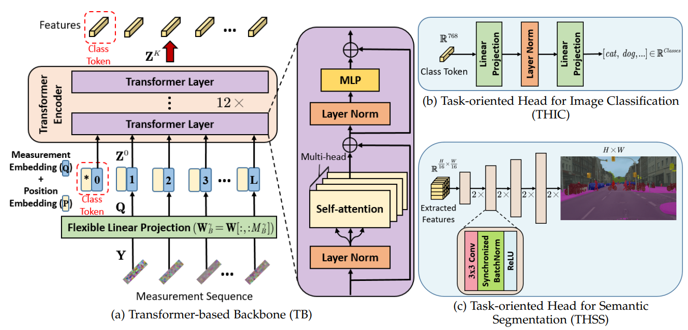

# 📖TransCL: Transformer Makes Strong and Flexible Compressive Learning (TPAMI 2022)
>[](https://ieeexplore.ieee.org/document/9841016)<br>
>[Chong Mou](https://scholar.google.com.hk/citations?user=SYQoDk0AAAAJ&hl=en), [Jian Zhang](https://jianzhang.tech/) <br>


<p align="center">
  
</p>

## 🔧 Dependencies and Installation

- Python >= 3.6 (Recommend to use [Anaconda](https://www.anaconda.com/download/#linux) or [Miniconda](https://docs.conda.io/en/latest/miniconda.html))
- [PyTorch >= 1.4](https://pytorch.org/)
- At least two V100 GPUs are required.

### Installation

1. Clone repo

    ```bash
    git clone https://github.com/MC-E/TransCL.git
    cd TransCL-main
    ```

2. Install dependent packages

    ```bash
    pip install tensorboardX
    conda install pytorch=1.6.0 torchvision cudatoolkit=10.1 -c pytorch -y
    pip install mmcv-full==1.2.2 -f https://download.openmmlab.com/mmcv/dist/cu101/torch1.6.0/index.html
    ```

## Training for Classification
Please run the commands in the folder of `classification`. <br>
1. Prepare the training data of [ImageNet1K](https://image-net.org/download-images.php)
2. Download the pre-trained checkpoints of vision transformer from [link-ImageNet](https://disk.pku.edu.cn:443/link/9B8CAF903895E2BEDBA1E58641A3C4E3) and [link-CIFAR](https://disk.pku.edu.cn:443/link/1437785D0ECDE48C86AEC4EF13E61939). 
3. The training support ViT-base with patch size being 16 (`-a B_16_imagenet1k`) and 32 (`-a B_32_imagenet1k`).
#### Training on ImageNet with a fixed CS ratio
```bash
python main_imagenet.py -a 'B_32_imagenet1k' -b 128 --image_size 384 --gpu 0  --lr 1e-3 --log_dir logs/transcl_384_imagenet_p32_01 --cs=1 --mm=1 --save_path=transcl_384_imagenet_p32_01 --devices=4 --rat 0.1 --data /group/30042/public_datasets/imagenet1k
```

#### Training on ImageNet with random CS ratios
```bash
python main_arb.py -a 'B_32_imagenet1k' -b 128 --image_size 384 --gpu 0  --lr 1e-3 --log_dir logs/transcl_384_imagenet_p32_01 --cs=1 --mm=1 --save_path=transcl_384_imagenet_p32_01 --devices=4 --rat 0.1 --data /group/30042/public_datasets/imagenet1k
```

#### Training on Cifar10 with a fixed CS ratio
```bash
python main_cifar10.py -a 'B_32_imagenet1k' -b 128 --image_size 384 --gpu 0  --lr 1e-3 --log_dir logs/transcl_384_cifar10_p32_01 --cs=1 --mm=1 --save_path=transcl_384_cifar10_p32_01 --devices=4 --rat 0.1
```

#### Training on Cifar100 with a fixed CS ratio
```bash
python main_cifar100.py -a 'B_32_imagenet1k' -b 128 --image_size 384 --gpu 0  --lr 1e-3 --log_dir logs/transcl_384_cifar100_p32_01 --cs=1 --mm=1 --save_path=transcl_384_cifar100_p32_01 --devices=4 --rat 0.1
```

## Training for Segmentation
Coming soon

## Testing for Classification
You can download the pre-trained checkpoints from our model zoo.
### Testing on ImageNet with a fixed CS ratio
```bash

python test_imagenet.py -a 'B_32_imagenet1k' -b 128 --image_size 384
```

### Testing on ImageNet with arbitrary CS ratios
```bash

python test_arb.py -a 'B_32_imagenet1k' -b 128 --image_size 384
```

## Testing for Segmentation
Coming soon

## :european_castle: Model Zoo
### Classification

| Mode        |                           Download link                     | 
| :------------------- | :--------------------------------------------: |
| Pre-trained ViT        |                           [ImageNet](https://disk.pku.edu.cn:443/link/9B8CAF903895E2BEDBA1E58641A3C4E3), [CIFAR](https://disk.pku.edu.cn:443/link/1437785D0ECDE48C86AEC4EF13E61939)                     |  
| ImageNet classification (patch size=16, ratio={0.1, 0.05, 0.025, 0.01})       |                           [URL](https://disk.pku.edu.cn:443/link/750ECBBCE56BC0A60A81CA2C9B09DEE1)                     |  
| ImageNet classification (patch size=32, ratio={0.1, 0.05, 0.025, 0.01})       |                           [URL](https://disk.pku.edu.cn:443/link/2713FF6650438ACDAB39411A74FF9334)                     |
| Cifar10 classification        |                           URL                     |  
| Cifar100 classification        |                           URL                     |  
| Arbitrary ratio classification        |                           URL                     | 
| Binary sampling slassification        |                           URL                     | 
| Shuffled classification        |                           URL                     | 

### Segmentation

| Mode        |                           Download link                     | 
| :------------------- | :--------------------------------------------: |
| Pre-trained ViT-large        |                           URL                    |  
| Segmentation on ADE20K with fixed ratio (patch size=16, ratio={0.1, 0.05, 0.025, 0.01})       |                       URL                    |  
| Segmentation on Cityscapes with fixed ratio (patch size=16, ratio={0.1, 0.05, 0.025, 0.01})        |                          URL                    |
| Segmentation on Pascal Context with fixed ratio (patch size=16, ratio={0.1, 0.05, 0.025, 0.01})        |                          URL                    |
| Segmentation with arbitrary ratios    |                          URL                    |
| Segmentation with binary sampling    |                          URL                    |
